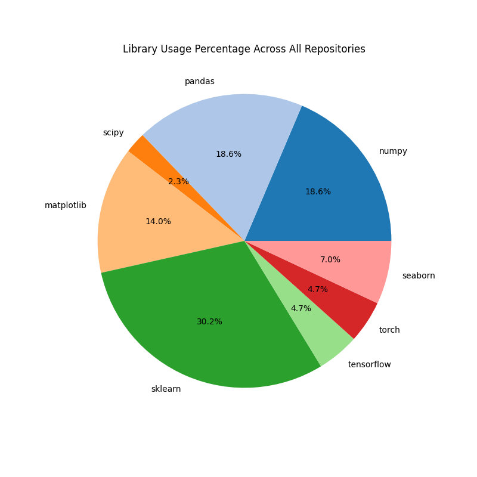

<h1 align="center">Hi 👋, I'm Devi Sri Bandaru</h1>

### About Me
 <h3 align="center">I am a graduate computer science student with a deep interest in developing intelligent systems using AI and machine learning. My primary focus is on creating solutions that leverage large language models (LLMs) and natural language processing (NLP).</h3>

- 👨🏼‍💻 I’m addicted to learning and growing every day.
- Passionate to apply my skills in healthcare and social good projects to positively impact the world.

# Connect with me on

  
    

# My tech stack

### Programming Languages

    
    
    
    

### Data & Machine Learning

    
    
    
    
    

### Data Visualization & Documentation

    
    

### Databases & DevOps

    
    
    

### Version Control & Collaboration

    
    

### IDE & Development Tools

    
    
  

## GitHub Stats

